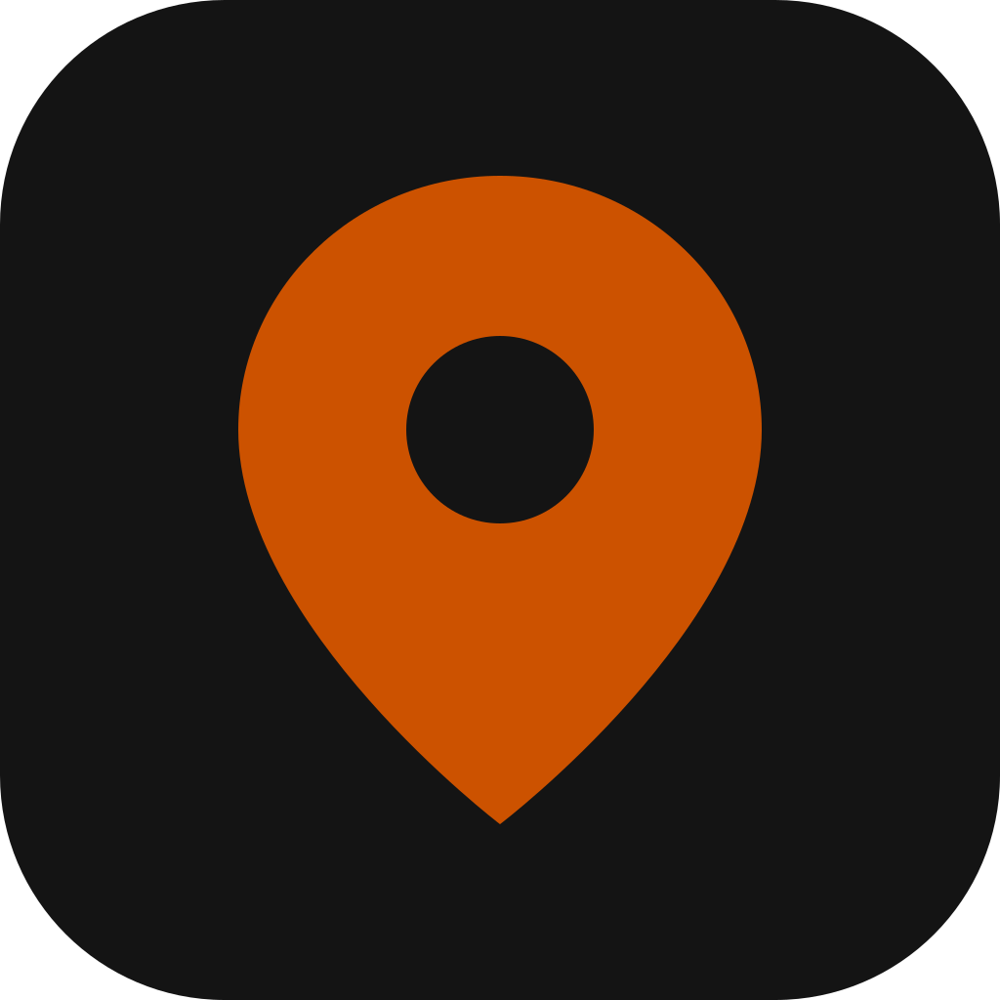
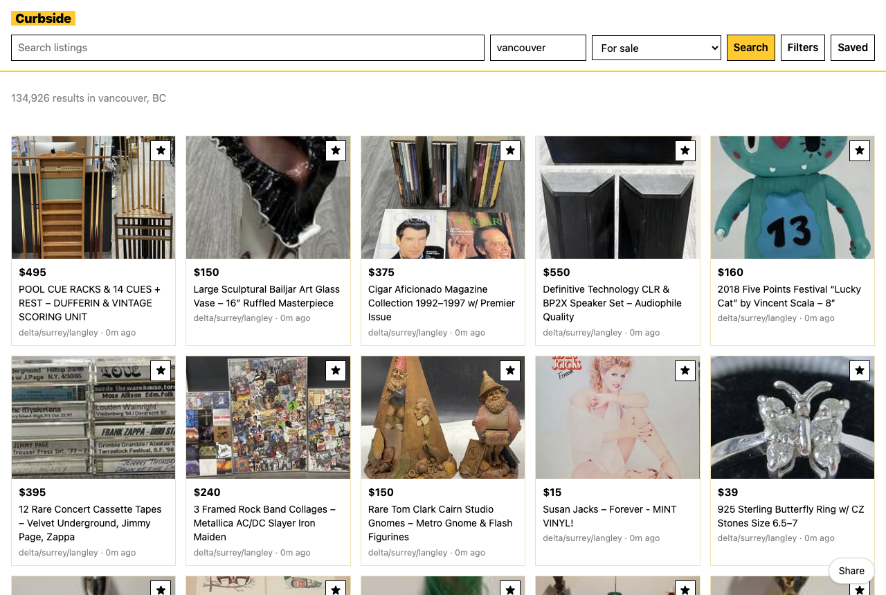

# Curbside

  [](https://github.com/nulljosh/curbside)

**Live:** https://curbside.heyitsmejosh.com





Craigslist, without the 2003.

Pick a city. Search. Read the post. Save the ones you like. That's the whole app, on the web and native on iPhone and Mac.

## Features

- Any Craigslist city, found by name
- Search results the way they should look: image, price, title, place
- Favourites, kept on your device and nowhere else
- Native iOS and macOS apps that talk to Craigslist directly. No server in between
- A Cloudflare Worker for the web version, cached five minutes

## Run

```sh
cd worker && node --test decode.test.mjs && npx wrangler dev
xcodegen generate && open Curbside.xcodeproj
```

## License

MIT 2026 Joshua Trommel

## Whitepaper

[Technical whitepaper](WHITEPAPER.md)
